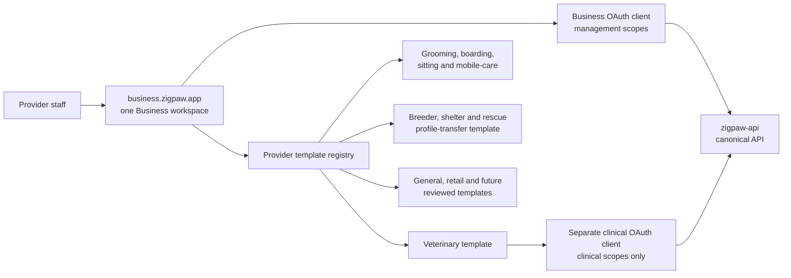
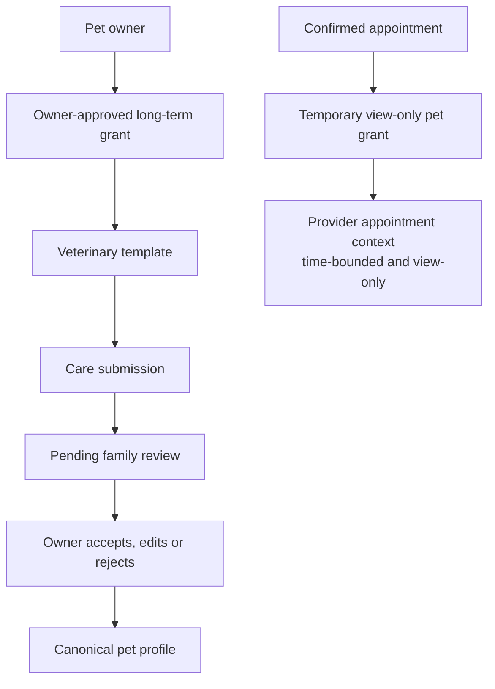
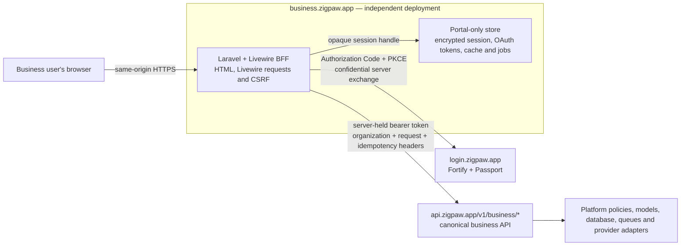
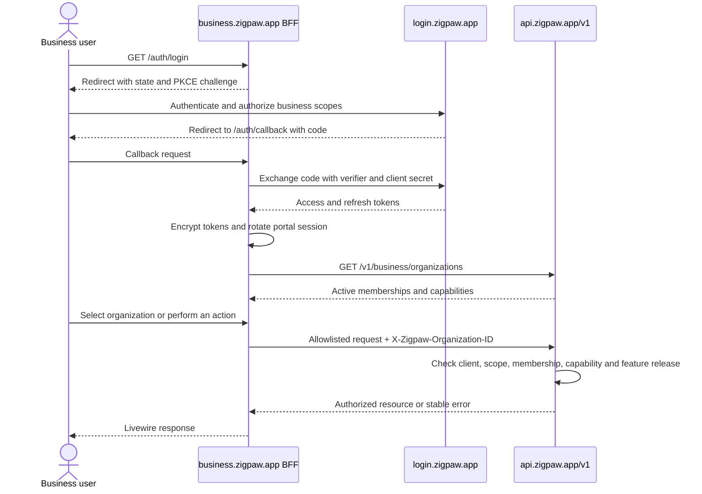

# Zigpaw Business

`zigpaw-business` is one provider workspace for every organization that serves pets. It is a single Laravel/Livewire BFF at `business.zigpaw.app`; the workspace selects a category template instead of deploying separate vet, groomer, kennel, breeder, or shelter applications.

The browser receives only an opaque, host-only session and never receives platform access or refresh tokens.

## Provider templates

| Category | Template | Typical capabilities | Additional boundary |
| --- | --- | --- | --- |
| Veterinary clinic / hospital | `veterinary` | Organization profile, appointments, grant-scoped patients, clinical submissions | Separate `business_clinical` OAuth client; clinical scopes; live purpose-bound pet grant |
| Groomer / mobile pet wash | `grooming` / `mobile_service` | Services, availability and booking responses | Business OAuth client; confirmed appointment access |
| Kennel / boarding / pet sitter | `boarding` / `pet_sitting` | Services, booking windows and care handover context | Business OAuth client; confirmed appointment access |
| Breeder / shelter / rescue | `breeding` / `shelter` | Organization-owned pet profiles and expiring family claims | Business OAuth client; explicit claim and transfer workflow |
| Trainer, retailer and future categories | `general` or reviewed template | Directory profile, offerings and bookings where released | Business OAuth client; category capabilities and release flags |

Insurance and other online products remain directory/affiliate resources, not Business provider templates. The category is data-driven by the platform provider taxonomy; one organization can manage multiple reviewed provider places and offerings.





## Boundary

- Production: `business.zigpaw.app`.
- Local: `business.zigpaw.test`.
- Identity: `login.zigpaw.app` using Authorization Code, PKCE and confidential clients.
- Canonical API: `https://api.zigpaw.app/v1`.
- Management audience: `/v1/business/*` with `business:*` scopes.
- Clinical audience: `/v1/business/clinical/*` with `clinical:read` and `clinical:submit` scopes.
- Organization context: every tenant request carries an explicit `X-Zigpaw-Organization-ID` selected from active memberships.
- Data ownership: the canonical `zigpaw-api` platform owns organizations, provider listings, locations, bookings, agreements, partner programs, commission accruals, clinical grants, submissions, and opaque references to externally completed settlements. Zigpaw does not collect provider bank details or execute provider payouts in this phase. This repository owns presentation, browser sessions, and server-side OAuth token custody only.

The platform checks both token scope and the authenticated user's active organization membership before it returns data or accepts a write. Sign-out requests canonical token revocation and a signed identity-session termination, then always invalidates the local portal session even if the upstream service is unavailable. Do not add direct database access as a shortcut.

Provider identity and commercial participation are intentionally separate. A business can claim and manage a listing without joining a referral program, and a commercial agreement never changes organic directory ranking.

Management and clinical sessions use different OAuth clients, token handles, scopes and cache entries even though both templates run here. Clinical methods in `PlatformApiClient` require `ClinicalPortalAccessTokenStore` explicitly; a management bearer cannot be passed to them accidentally.

## Deployment And Trust Topology



There is no browser-facing copy of the canonical API and no platform database connection in this repository. The same-origin BFF surface is the Laravel/Livewire application itself. Its local migrations are restricted to session, cache, and jobs infrastructure; they must never grow platform organization, provider, booking, agreement, customer, or finance models.

The production browser cookie is host-only, `Secure`, `HttpOnly`, `SameSite=Lax`, and encrypted. OAuth tokens are encrypted in the server-side cache behind a random session handle. The client secret and tokens are server-only. Production configuration must not use the deterministic local-development secret fallback.



## Workspace

The portal presents:

- managed provider listings and claim progress;
- service offerings and booking configuration;
- customer booking requests and provider responses;
- optional referral and distribution programs;
- read-only commission statements and disclosed agreements, with no bank or payout onboarding;
- role-scoped team access.

New behavior remains API-first: implement authorization, validation, resources, versioned routes and contract tests in `zigpaw-api`, then consume it here. Never add direct access to the platform database.

## Current Capabilities

| Workspace area | Implemented operations | Platform enforcement |
| --- | --- | --- |
| Organization context | List active organizations, switch context, and load organization-scoped identity/capabilities. | First-party Business client, OAuth scopes, active membership, explicit organization header. |
| Business profile | Read and update the organization's confirmed business profile. | `organization.manage` capability and platform validation/audit. |
| Locations and claims | View managed providers and claim history, discover claimable providers, submit claims, and edit an authorized provider/place. | Provider-link authority, `providers.manage`, claim validation, and feature state. |
| Services | List, create, update, and retire offerings for an authorized provider link. | Provider ownership, granular write scope/capability, validation, and idempotency. |
| Booking setup and requests | Configure booking availability and respond to customer requests when the booking feature is released for the organization. | `booking_requests` release flag, booking capability, state machine, organization ownership, and idempotency. |
| Partner programs | Browse available programs and apply for optional participation. | Program capability, eligibility, disclosure, and enrollment state. |
| Revenue | Read agreements, commission entries, and financial summaries. | Read-only financial scope and organization ownership; no payment or payout action exists here. |
| Team | Invite staff, resend invitations, change roles, and revoke membership within the caller's authority. | `team.manage`, role ceiling, active membership, validation, and audit. |

Navigation is derived from API-provided capabilities and release state. Hiding an item in Livewire is presentation only; the platform must independently reject every unauthorized request.

## Explicitly Out Of Scope

- Provider bank details, identity/KYB collection, payment processing, settlement, and payout initiation.
- Consumer pet, Finder, recovery, clinical, subscription, or billing data.
- Organic directory ranking changes in exchange for an agreement. Sponsored placements remain separately labeled platform data.
- Local copies of platform models, authorization rules, provider credentials, or business records.
- A compatibility path to a removed historical partner or veterinary portal implementation.

## Setup

```bash
composer install
npm install
cp .env.example .env
php artisan key:generate
php artisan migrate
npm run build
```

Configure the management client with `PLATFORM_API_URL`, `PLATFORM_AUTH_URL`, `PLATFORM_OAUTH_CLIENT_ID`, `PLATFORM_OAUTH_CLIENT_SECRET`, and `PLATFORM_OAUTH_REDIRECT_URI`. Configure the clinical client separately with `PLATFORM_CLINICAL_OAUTH_CLIENT_ID`, `PLATFORM_CLINICAL_OAUTH_CLIENT_SECRET`, `PLATFORM_CLINICAL_OAUTH_SCOPES`, and `PLATFORM_CLINICAL_OAUTH_REDIRECT_URI`. The callbacks are explicitly allowlisted on their matching platform clients; secrets remain server-only.

The canonical production callbacks are `https://business.zigpaw.app/auth/callback` and `https://business.zigpaw.app/clinical/auth/callback`; local development uses the matching `business.zigpaw.test` paths. Never derive either callback or a post-login destination from an untrusted request host. Keep `SESSION_DOMAIN` empty so the `__Host-zigpaw-business-session` cookie cannot escape this host.

The database session/cache defaults in `.env.example` are for local development. Production readiness requires Redis for this portal's session and cache stores so encrypted token custody, refresh locking, and multi-instance behavior remain consistent. Business cookie names, cache prefixes, encryption keys, token handles, and session records must not be shared with any other Zigpaw host.

## Verification

```bash
php artisan test --compact
composer analyse
vendor/bin/pint --dirty --format agent
npm run build
composer audit --locked --no-interaction
npm audit --audit-level=high
```

| Gate | Command or check | What it proves |
| --- | --- | --- |
| Behavior | `php artisan test --compact` | OAuth state/PKCE, token custody and refresh, capability/feature navigation, organization isolation, writes, pagination, errors, and operational boundaries. |
| Static contract | `composer analyse` | PHP/Larastan types agree across the portal and platform transport. |
| Style | `vendor/bin/pint --test` in CI | Committed PHP follows the repository format without a mutating CI pass. |
| Production assets | `npm run build` | The independently namespaced Business CSS/JavaScript bundle compiles. |
| Supply chain | `composer audit --locked --no-interaction` and `npm audit --audit-level=high` | Locked PHP and npm dependencies have no silently accepted high-severity advisory. |
| Runtime boundary | `/health`, `/health/ready`, and browser OAuth smoke | The portal, local store, safe OAuth configuration, identity handoff, canonical API, and sign-out/revocation path are production-shaped. |
| Repository hygiene | CI Gitleaks history scan | Server-only client secrets and OAuth tokens were not committed. |

The CI release gate runs install, dependency audits, Pint check, Larastan, the full PHPUnit suite, production asset build, and a separate full-history secret scan. A UI-only pass is insufficient: the corresponding platform API contract and its authorization/contract tests must pass before this portal is deployable.

The August 16, 2026 checkpoint passed **29 PHPUnit tests / 111 assertions**, Larastan, Pint, the production Vite build, Composer/npm audits, and browser verification of the OAuth handoff and rejection of a customer without Business authority. Treat that as evidence for the reviewed revision, not a substitute for rerunning the gates.

## Release Rules

1. Implement the canonical `/v1/business/*` or `/v1/business/clinical/*` operation, policy, Form Request, Resource, scope/capability mapping, idempotency/audit behavior, and contract tests in `zigpaw-api` first.
2. Confirm the operation is present in the reviewed Business or clinical OpenAPI audience bundle and approved for the intended release phase.
3. Add only the allowlisted server-side transport and Livewire experience needed for that operation. Do not proxy arbitrary URLs.
4. Pass both repositories' release gates and a production-host OAuth/browser smoke test.
5. Deploy the canonical API before this client and retain independently versioned Business assets and rollback artifacts.

Canonical platform decisions:

- [Architecture](https://github.com/boreanis/zigpaw-api/blob/main/docs/09_ARCHITECTURE.md)
- [Production delivery](https://github.com/boreanis/zigpaw-api/blob/main/docs/10_DEPLOYMENT_PRODUCTION.md)
- [Provider integrations](https://github.com/boreanis/zigpaw-api/blob/main/docs/11_PROVIDER_INTEGRATIONS.md)
- [Business strategy](https://github.com/boreanis/zigpaw-api/blob/main/docs/01_BUSINESS_STRATEGY.md)
