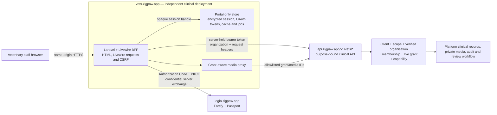
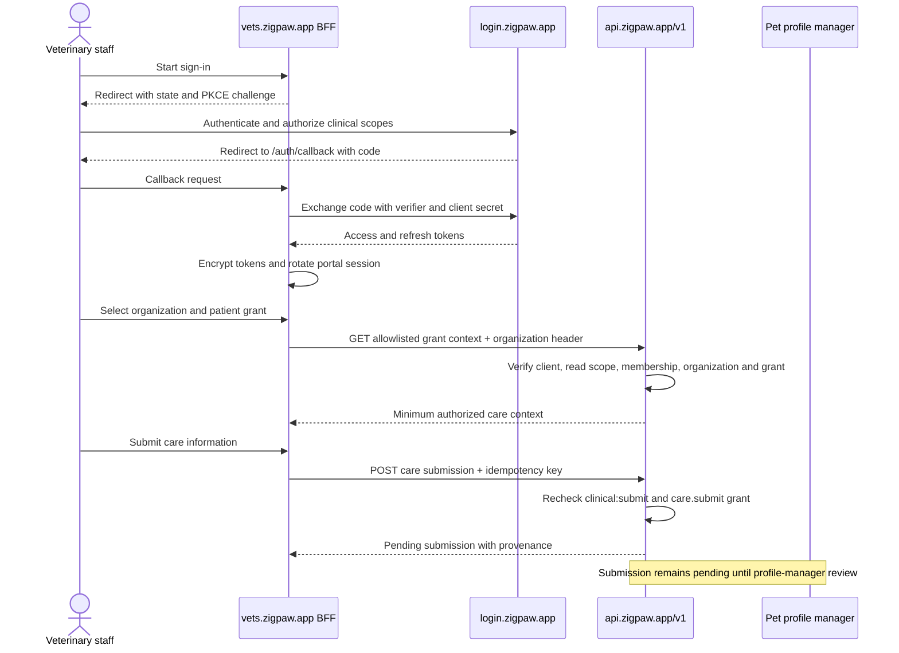

# Zigpaw Clinical Portal

The separately deployed portal for authenticated veterinary organisations. It uses Laravel 13 and Livewire 4 as an OAuth BFF and presents only API-authorized clinical context.

## Boundary

- Production host: `vets.zigpaw.app`.
- Local host: `vets.zigpaw.test`.
- Identity: `login.zigpaw.app` Authorization Code + PKCE.
- Canonical API: `https://api.zigpaw.app/v1`, using only the purpose-bound `/v1/vets/*` audience through a confidential BFF client.
- Browser authority: an opaque, host-only `Secure`/`HttpOnly` session cookie; OAuth access and refresh tokens stay encrypted in server-side cache.
- Does not own: platform MySQL, pet/clinical Eloquent models, finder data, billing data, provider credentials, or profile-manager approval rules.

Every clinical data action remains constrained by an active veterinary organisation membership, a matching portal OAuth client/scope, and (where a pet record is involved) an explicit, purpose-bound grant. Submitted records remain pending until the pet profile manager reviews them.

## Deployment And Trust Topology



The same-origin BFF surface is the Laravel/Livewire application; it does not expose a second public API. Its local migrations are restricted to session, cache, and jobs infrastructure. Platform pets, grants, clinical records, submissions, organizations, and media metadata must never be mirrored into local models.

The `__Host-zigpaw-vets-session` cookie is host-only, `Secure`, `HttpOnly`, `SameSite=Lax`, and encrypted. OAuth tokens are encrypted in the server-side cache behind a random session handle. The confidential client secret and tokens are server-only, and production must not use the deterministic local-development secret fallback.

## Current Contract Coverage

The portal provides an organisation-scoped overview, grant-scoped patient list and patient care context, protected shared-media proxy, pending clinical submission form, and submission status/history. Every upstream call uses one explicitly allowlisted `/v1/vets/*` operation. The platform—not this BFF—rechecks the portal client, OAuth scope, organisation membership, grant status, capability, pet relationship, and submission provenance.

The current platform contract intentionally does not provide organisation editing, grant creation or revocation, media uploads, veterinary vaccine/medication catalogue search, or the detailed body of an earlier submission. Those workflows must not be approximated from local data. Add a versioned platform contract and contract tests before adding the corresponding portal screen.

For every new clinical action, add the platform grant/policy/provenance behavior, Form Request, API Resource, versioned contract, idempotency for writes, and contract tests before building the Livewire screen here.

## Current Capabilities

| Workspace area | Implemented operations | Platform enforcement |
| --- | --- | --- |
| Organization context | List available veterinary organizations, switch context, load identity/capabilities, and view the organization dashboard. | First-party Vets client, `clinical:read`, active membership, verified veterinary organization, explicit organization header. |
| Patients | Search and page provider grants by status, open one grant, and view only its allowed pet/care context. | Organization-owned purpose-bound grant; the platform limits visible context and available actions by status, capability, expiry, and revocation. |
| Shared media | List grant-authorized media and stream an approved item through the BFF. | Exact route/method allowlist, validated UUID/integer identifiers, active grant, media authorization, safe response headers. |
| Care submission | Submit a grant-scoped care record with a stable idempotency key. | `clinical:submit`, live grant with `care.submit`, validation, idempotency, and organization/membership/client/grant provenance. |
| Submission history | List and inspect submission status/history available to the current organization. | Organization ownership and `clinical:read`; detailed historical bodies remain unavailable until the API provides them. |

The portal BFF has an exact method-and-path allowlist. It cannot turn user input into an arbitrary platform URL, query unscoped pets, or use a browser-provided organization as authority.



Submission is not direct write access to an owner's health history. The platform captures provenance and holds the record pending until the profile manager approves or rejects it.

## Explicitly Unavailable

- Organization editing or onboarding from this portal.
- Provider-grant creation, extension, or revocation.
- Media upload or unrestricted private-media download.
- Veterinary vaccine or medication catalogue search.
- The detailed clinical body of an earlier submission.
- General pet search, Finder/recovery contacts, customer billing, commerce, tags, or account management.

Do not approximate these features with browser state or a local database. Add and review the purpose-bound platform contract first.

## Setup

```bash
composer install
npm install
cp .env.example .env
php artisan key:generate
php artisan migrate
npm run build
```

Configure `PLATFORM_API_URL`, `PLATFORM_AUTH_URL`, `PLATFORM_OAUTH_CLIENT_ID`, `PLATFORM_OAUTH_CLIENT_SECRET`, `PLATFORM_OAUTH_SCOPES="clinical:read clinical:submit"`, and `PLATFORM_OAUTH_REDIRECT_URI`. The configured callback URL is never derived from the request host and must be allowlisted on the platform's veterinary BFF client. The client ID is configuration; the secret and OAuth tokens are server-only.

The canonical production callback is `https://vets.zigpaw.app/auth/callback`; local development uses `https://vets.zigpaw.test/auth/callback`. Keep `SESSION_DOMAIN` empty so the host-only session cannot escape the Vets origin.

The database session/cache defaults in `.env.example` are for local development. Production readiness requires Redis for this portal's session and cache stores so encrypted token custody, refresh locking, and multi-instance behavior remain consistent. Vets cookie names, cache prefixes, encryption keys, token handles, and session records must not be shared with any other Zigpaw host.

Set `CACHE_LIMITER=health_limiter` so health probes retain a bounded, per-instance file-backed throttle even when the application Redis cache is unavailable. Apply the corresponding distributed limit at the deployment edge.

## Verification

```bash
php artisan test --compact
composer analyse
vendor/bin/pint --dirty --format agent
npm run build
composer audit --locked --no-interaction
npm audit --omit=dev --audit-level=high
```

| Gate | Command or check | What it proves |
| --- | --- | --- |
| Behavior | `php artisan test --compact` | OAuth state/PKCE, encrypted token custody/refresh/revocation, organization switching, grant isolation, exact route allowlist, media proxy, idempotent submissions, safe errors, and operational boundaries. |
| Static contract | `composer analyse` | PHP/Larastan types agree across Livewire state, the BFF transport, and normalized platform responses. |
| Style | `vendor/bin/pint --test` in CI | Committed PHP follows the repository format without a mutating CI pass. |
| Production assets | `npm run build` | The independently namespaced Vets CSS/JavaScript bundle compiles. |
| Supply chain | `composer audit --locked --no-interaction` and `npm audit --omit=dev --audit-level=high` | Locked production dependencies have no silently accepted high-severity advisory. |
| Runtime boundary | `/health`, `/health/ready`, and browser OAuth smoke | The portal, local store, safe OAuth configuration, identity handoff, canonical API, secure headers, and sign-out path are production-shaped. |
| Repository hygiene | CI Gitleaks history scan | Clinical client secrets and OAuth tokens were not committed. |

The August 16, 2026 checkpoint passed **52 PHPUnit tests / 200 assertions**, Larastan, Pint, the production Vite build, Composer/npm audits, and a browser smoke test on `https://vets.zigpaw.test`. Treat that as evidence for the reviewed revision, not a substitute for rerunning the gates.

## Release Rules

1. Implement the canonical `/v1/vets/*` operation, purpose/grant policy, scopes, Form Request, Resource, provenance, idempotency/audit behavior, and contract tests in `zigpaw` first.
2. Confirm the operation is present in the reviewed clinical OpenAPI audience bundle and exposes only the minimum necessary fields.
3. Add one exact BFF route pattern and the smallest Livewire workflow that consumes it. Do not add a generic proxy.
4. Pass the platform and portal release gates, then browser-test authorization denial as well as the happy path.
5. Deploy the canonical API before this portal and retain independently versioned Vets assets and rollback artifacts.

Deploy its release assets only beneath `assets.zigpaw.app/vets/<release>/`.

Canonical platform decisions:

- [Architecture](https://github.com/boreanis/zigpaw/blob/main/docs/09_ARCHITECTURE.md)
- [Production delivery](https://github.com/boreanis/zigpaw/blob/main/docs/10_DEPLOYMENT_PRODUCTION.md)
- [Provider integrations](https://github.com/boreanis/zigpaw/blob/main/docs/11_PROVIDER_INTEGRATIONS.md)
- [Pet health and Pawsport](https://github.com/boreanis/zigpaw/blob/main/docs/07_PETS_HEALTH_PAWSPORT.md)
